## DIY SuzyQCable on a breadboard (No soldering)

_Do not follow instructions from here unless you wholly accept any and all loss, damage, harm and liability as solely your responsibility._

### Requirements

- Needle nose pliers (This is not a luxury item)
- Breadboard (SYB-170 Mini Solderless)
- USB A male connector PCB **with pin headers soldered**
- USB C male test board 24 pin **with pin headers soldered**
- Breadboard Dupont cable 
    - minimum 2 x male-to-male
    - minimum 2 x female-to-female
    - minimum 14 x male-to-female
    - Red, Green, White, Black + any other 2 tones

- 22k resistor (1/4W is fine)
- 56k resistor (1/4W is fine)

### Part A. Connections

Use cables connecting from USB A to breadboard

If you can directly plug the USB A board's pins into the breadboard, with the connector able to plug in, that should give you 4 tracks.

VBUS1 and VBUS2 are two different connections into the board itself.

22K and 56K are connections to each leg of each resistor.

Silkscreen printing labels and orientation that worked for me is: 

    
If you've build the above, test the connection as per the [next section](#Part-B.-Testing). If that did not work:

###### return here 

If the printing on the silkscreen is correct and not a reverse, you need to change four connections for white, green and 2 resistors, check `A5, B5, A8, B8` like so:

```mermaid
graph TB
    subgraph Breadboard - Orientation B
        %% --- FROM TOP TO BOTTOM ---

        %% Row 1 (top): GND (Black)
        GND(("GND (Ground)")) ==> R5a(X) --- R5b([A1]) --- R5c([B12]) --- R5d([B1]) --- R5e([A12])

        %% Row 2: D+ (Data plus, White)
        DP(("D+ (Data +)")) ==> R6a(X) --- R6b(_) --- R6c(_) --- R6d(_) --- R6e((A5))

        %% Row 3: D- (Data minus, Green)
        DM(("D- (Data -)")) ==> R7a(X) --- R7b(_) --- R7c(_) --- R7d(_) --- R7e((B5))

        %% Row 4 (bottom): 5V (VBUS, Red)
        5V(("5V (VBUS)")) ==> R8a(X) --- R8b((VBUS1️↙️)) --- R8c(_) --- R8d(_) --- R8e((VBUS2👇))
        
        %% --- AUX ROWS (breadboard “inner” rows) ---
        %% Aux Row A
        R1a((VBUS1↗️)) --- R1b([A4]) --- R1c([B9]) --- R1d([B4]) --- R1e([A9])
        
        %% Aux Row B
        R2a((56K R🦗)) --- R2b(_) --- R2c((22K R🐜)) --- R2d(_) --- R2e((VBUS2👆))
        
        %% Aux Row C
        R3a((56K R🦗)) --- R3b(_) --- R3c(_) --- R3d(_) --- R3e((A8))
        
        %% Aux Row D
        R4a(_) --- R4b(_) --- R4c((22K R🐜)) --- R4d(_) --- R4e((B8))
    end

    %% --- CLASS DEFINITIONS (5px width) ---
    
    classDef Red    stroke:#d00,stroke-width:5px;
    classDef White  stroke:#ddd,stroke-width:5px;
    classDef Green  stroke:#0b0,stroke-width:5px;
    classDef Black  stroke:#000,stroke-width:5px;
    %% Translucent red fill for VBUS jumpers
    classDef VRed   stroke:#d00,stroke-width:5px,fill:#f88,fill-opacity:0.5;
    %% 56k resistor body (blue fill) and end (blue border)
    classDef R56Leg stroke:#00f,stroke-width:5px,fill:#88f,fill-opacity:0.5;
    classDef R56End stroke:#00f,stroke-width:5px;
    %% 22k resistor body (brown fill) and end (brown border)
    classDef R22Leg stroke:#8B4513,stroke-width:5px,fill:#D2B48C,fill-opacity:0.5;
    classDef R22End stroke:#8B4513,stroke-width:5px;
    %% Empty class
    classDef Fillfree  fill:None;

    %% --- APPLY CLASSES ---
    
    %% GND (top rail, Black)
    class GND,R5a,R5b,R5c,R5d,R5e Black;

    %% D+ is WHITE
    class DP,R6a,R6e White;

    %% D- is GREEN
    class DM,R7a,R7e Green;
    
    %% 5V rail (Red) and its non-jumper points
    class 5V,R8a,R1b,R1c,R1d,R1e Red;

    %% VBUS jumpers (translucent red fill)
    class R8b,R8e,R1a,R2e VRed;

    %% 56k resistors: body (blue fill) and end (blue border)
    class R2a,R3a R56Leg;
    class R3e R56End;

    %% 22k resistors: body (brown fill) and end (brown border)
    class R2c,R4c R22Leg;
    class R4e R22End;

    class R6b,R6c,R6d,R7b,R7c,R7d,R8c,R8d,R2b,R2d,R3b,R3c,R3d,R4a,R4b,R4d Fillfree;
```

### Part B. Testing

1. On one host, run `sudo dmesg -W`

2. Connect the USB A to that host

3. Connect the USB C side into the Chrome device

4. If you don't see 'CR50' or 'Google Converter' on the dmesg host, flip the USB C connector the other way.

5. If you still do not see anything, check every single connection for any looseness and tighten everything with the needle nose pliers.

6. Still see nothing? Change the A5, B5, A8, B8 to `Breadboard (Orientation B)`, from [the above](#return-here).

7. Still didn't work? Ask someone in PMOS community